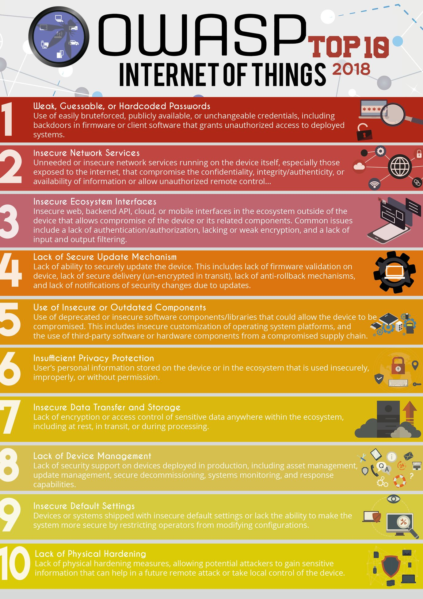

### 物聯網的資訊安全
```
• 非傳統的物件透過網路相連並且互相交換資料

• 物聯網中的物件數量龐大，代表可能受到資安攻擊的目標越多，容易成為資安的弱點

• 物聯網容易成為駭客橫行的天堂

• 物聯網的威脅更多元化，例如車載加入物聯網之後，就有可能成為駭客控制與操控的目標，對生活的環境產生危害
```
### 物聯網(IoT)的定義
```
• 物聯網是由多個實體物件所形成的網路

• 這些物件內有電子裝置、軟體、感測器與網路連接的能力，目的是讓物件本身產生更高的價值與服務

• 達到這個目的的方式是與製造商、電信業者或是其他連接的裝置交換資料

• 每個物聯網的物件都能透過其內部的運算系統被辨識，等於有個別唯一的身份，而且能夠在目前的網際網路的架構下相容地運作
```
### 物聯網的安全威脅
```
• 相連的物件在設計之初很可能完全沒有考量資安的問題

• 內含的作業系統與軟體可能極為老舊或是有許多弱點與漏洞

• 物聯網可能存在著眾多脆弱的資安物件與漏洞

• 傳統的攻擊手法很容易移植到物聯網中作用
```
### 造成IoT資安問題的大致分為四大塊：
```
1.   終端裝置資安問題
2.   通訊媒介資安問題
3.   後端伺服器資安問題
4.   行動裝置資安問題
```

### OWASP IoT Top 10
```
https://www.owasp.org/index.php/OWASP_Internet_of_Things_Project
```


```

I1: 不安全的網頁介面 (Insecure Web Interface)
           
I1其實也就是一般最常見的Web安全，任何網站在實作上可能產生的漏洞(SQLi, XSS, CSRF…)都在這個範疇，
可參考OWASP Top 10

I2: 不充分的認證與授權 (Insufficient Authentication/Authorization)
           
任何需要存取的動作，都需要去確認認證與授權是否合法。
那麼在IoT中要去哪裡檢查認證與授權呢？答案是找出整個IoT架構中所有的介面(Interface)，無論是雲端提供介面給設備傳遞資料過去，或者是使用者透過行動裝置連至雲端提供的行動介面存取資料。建議做法如啟用雙因子認證、當使用到一些比較敏感的功能可以進行重新認證、確保發給client的認證token/session key保持不一樣等。

I3. 不安全的網路服務 (Insecure Network Services)
           
若物聯網裝置有不安全的網路服務公開在Local或Global Network，
可能會導致Buffer Overflow或DoS的問題，可以利用自動化工具如Port Scanner或Fuzzer。

I4. 欠缺傳輸時的加密保護 (Lack of Transport Encryption)
           
物聯網資料間的傳輸，無論是有線或無線的都可能使用各式各樣的協定或技術(BLE, TLS, RFID, NFC…)。
這些協定或技術在傳輸時是否會進行加密其實也不一定，需要去了解這些協定的實作。

I5. 隱私威脅 (Privacy Concerns)
           
這個部分舉例來說，當使用者在設定或啟用物聯網裝置時，可以去檢查看看裝置所蒐集的資料。
裝置是建議最好不要蒐集敏感性資料，要儲存的話可將資料去識別化或匿名後再儲存。

I6. 不安全的雲端介面 (Insecure Cloud Interface)
           
關於雲端介面的安全性，OWASP也有Cloud Top 10，不過這Top 10會包含整個雲的安全性問題
，但這邊主要著重在提供給使用者/管理者的雲端介面安全。

I7. 不安全的行動介面 (Insecure Mobile Interface)
           
關於行動介面的安全性，OWASP也提出了Mobile Top 10可以參考。
基本上不外乎提供給使用者操作的行動介面證機制是否安全完善、資料傳輸時是否安全、連續登入失敗帳號是否鎖定、
密碼復原機制是否有漏洞、APP是否有進行混淆或防竄改機制等。

I8. 不充分的安全設定 (Insufficient Security Configurability)
          
I8談的是物聯網裝置的安全設定，例如有些設備可能提供可以設定密碼的功能，
但卻沒強制一定要輸入”強”密碼，這是一種安全性設定的不足；
又或者傳輸中的或儲存在設備上的敏感資料未加密也是一種。
另外也建議IoT設備可以對於安全事件做紀錄或通知使用者。

I9. 不安全的軟體與韌體 (Insecure Software/Firmware)
           
此部分主要鎖定在IoT設備軟體/韌體更新的安全性。若設備具有自動更新功能時，
除了更新伺服器的安全外，更新檔傳輸時(是否使用加密通道)
以及更新檔本身的安全性(檔案是否加密、是否簽章並在傳遞/安裝前驗證過)都很重要。

I10. 實體安全考量不足 (Poor Physical Security)
           
I10考量到物聯網裝置的實體安全，例如裝置是否有可卸除式儲存設備如SD Card能輕易移除，
若裡面的資料又未加密則可能遭到竊取或竄改；又或者有些物聯網設備可能會透過USB Port進行軟體更新，
此USB Port若未受控制，也可能被利用於修改設備軟體或拿來複製資料。
```
### OWASP Project中提及的IoT弱點：
```
1. 帳號列舉 (Username Enumeration)
2. 弱密碼 (Weak Passwords)
3.  帳號鎖定 (Account Lockout)
4. 服務未加密 (Unencrypted Services)
5. 雙因子認證 (Two-factor Authentication)
6. 弱加密實作機制 (Poorly Implemented Encryption)
7. 更新檔案傳送未加密 (Update Sent Without Encryption)
8. 更新檔案儲存位置可改寫 (Update Location Writable)
9. DoS (Denial of Service)
10.可移除儲存媒體 (Removal of Storage Media)
11.無手動更新機制 (No Manual Update Mechanism)
12.無更新機制 (Missing Update Mechanism)
13.韌體版本或最後更新日期未顯示 (Firmware Version Display and/or Last Update Date)
14.韌體或儲存裝置可抽離 (Firmware and storage extraction)
15.裝置具程式碼執行弱點 (Manipulating the code execution flow of the device)
16.獲取主控台存取 (Obtaining console access)
```
