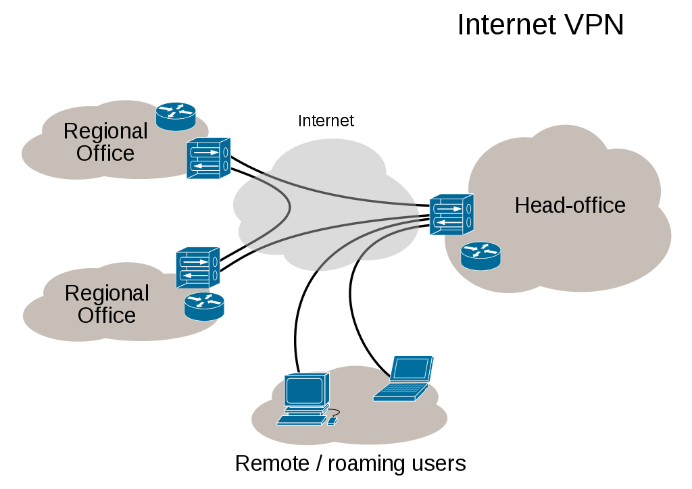
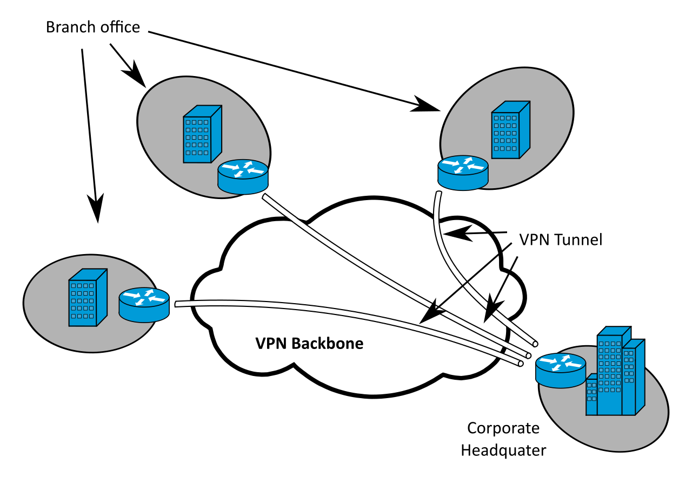

# 1.網路與通訊安全
```
  1.1.網路安全Network Security
    1.1.1.網路概論
    1.1.2.網路協定
    1.1.3.網路封包分析---使用wireshark
    1.1.4.網路攻擊手法分析
    1.1.5.網路防御實戰(1)---防火牆技術(Firewall)
    1.1.6.網路防御實戰(2)---入侵偵測系統實戰(intrusion detection system|snort)
  1.2.通訊安全Communications Security (COMSEC)
    1.2.1 無線網路
    1.2.2.無線網路攻擊手法分析
```
### CISSP相關主題:Domain 4—通訊及網路安全　Communication and Network Security
```
Communication and Network Security 
(Designing and Protecting Network Security)
■ A. Apply secure design principles to network architecture
  (e.g., IP & non-IP protocols, segmentation)
■ A.1 OSI and TCP/IP models
■ A.2 IP networking
■ A.3 Implications of multilayer protocols (e.g., DNP3)
■ A.4 [可略]Converged protocols (e.g., FCoE, MPLS, VoIP, iSCSI)
■ A.5 軟體定義網路[SDN,Software-defined networks]
■ A.6 Wireless networks
■ A.7 密碼學Cryptography used to maintain communication security

B. Secure network components 網路設備與元件的安全強化
■ B.1 Operation of hardware (e.g., modems, switches, routers,wireless access points, mobile devices)
      網路設備
■ B.2 Transmission media (e.g., wired, wireless, fiber)
■ B.3 Network access control devices (e.g., firewalls, proxies)
■ B.4 Endpoint security 端點安全設備
■ B.5 Content-distribution networks
■ B.6 Physical devices
```

# 強化安全的網路設備

## VPN 虛擬私人網路
```
https://en.wikipedia.org/wiki/Virtual_private_network
[Virtual Private Network，VPN]是一種常用於連接中、大型企業或團體與團體間的私人網路的通訊方法。
VPN利用隧道協定（Tunneling Protocol）來達到保密、傳送端認證、訊息準確性等私人訊息安全效果，
這種技術可以用不安全的網路（例如：網際網路）來傳送可靠、安全的訊息。
需要注意的是，加密訊息與否是可以控制的，如果是沒有加密的虛擬私人網路訊息依然有被竊取的危險。
```


### Site-to-site_VPN


### 常用的虛擬私人網路協定
```
L2F   L2TP  PPTP

IPsec [超重要] （如Cisco IPSec VPN）
SSL VPN[可取代 IPsec VPN?? 2019年爆發重大漏洞][如 AnyConnect（Cisco SSL VPN）]
```
```
IPSec VPN 和 SSL VPN 差異與競爭
https://kknews.cc/tech/avxayrn.html
https://www.ithome.com.tw/node/28980

第一，IPSec是以網絡層為中心，而SSL是以應用層為中心。
第二，IPSec需要專門的使用端軟體，而SSL使用任何SSL支持的瀏覽器為使用端。
最後，SSL原本是以機動性為中心而IPSec不是
https://kknews.cc/tech/avxayrn.html
```
```
各大學SSL VPN服務:
NCKU:http://cc.ncku.edu.tw/p/412-1002-7637.php?Lang=zh-tw
NTU:https://ccnet.ntu.edu.tw/vpn/for-windows.html
```

#### 範例試題
```
You are responsible for always-on VPN connectivity for your company. You have been
told that you must use the most secure mode for IPSec that you can. Which of the following
would be the best for you to select? A.Tunneling   B.AH    C.IKE  D.Transport
```
```
A
Option B is incorrect. Authentication Header (AH) provides authentication and integrity
but no encryption, so it cannot be the most secure mode.
Option C is incorrect. Internet Key Exchange (IKE) is used in setting up security associations
in IPSec.
```
